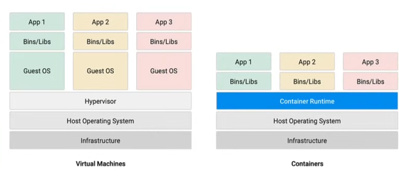
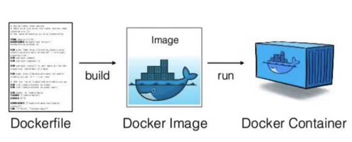
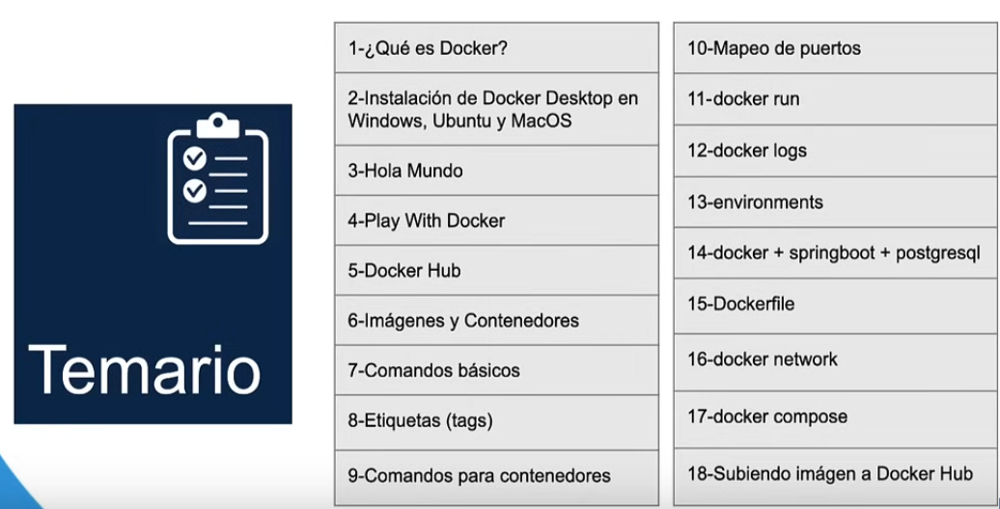
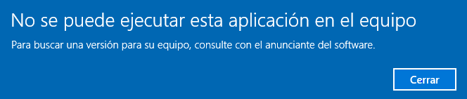

# Aprendiendo-Docker Fundamentos
Guia para el uso de docker

## Docker

- Plataforma de software
- Empaqueta en contenedores
- mayor productividad y facil administracion

## Docker vs maquinas virtuales

- se suelen confundir pero son muy diferentes
- kernel en linux en docker
- antes las empresas usaban las maquinas virtuales
- la maquina virtual tiene mucho peso de almacenamiento
- el objetivo de las maquinas virtuales era que varias maquinas con diferentes sistemas operativos funcionaran en una misma maquina fisica
- la maquina virtual ayuda a aislar el hardware
- en cambio docker permite ejecutar aplicaciones empaquetadas en un entorno aislado
- docker es open source, las aplicaciones se ejecutan indiferentemente del sistema operativo
- un equivalente a docker es podman
- 

## Caracteristicas
- hace que la aplicacion sea totalmente portable
-

## ¿Por que usar docker?

1. Envie mas software, mas rapido
2. Estandarice las operaciones
3. Transfiera de manera sencilla
4. Ahorre dinero

## ¿Cuando usar docker?

1. en microservicios
2. en integracion y entrega continua de despliegues
3. en procesamiento de datos
4. en contenedores como servicio

## Instalacion

- funciona para windows, linux y mac
- para windows:
    - ingresar a https://www.docker.com/
    - descargar el instalador
    - en windows me dio error: 

    

