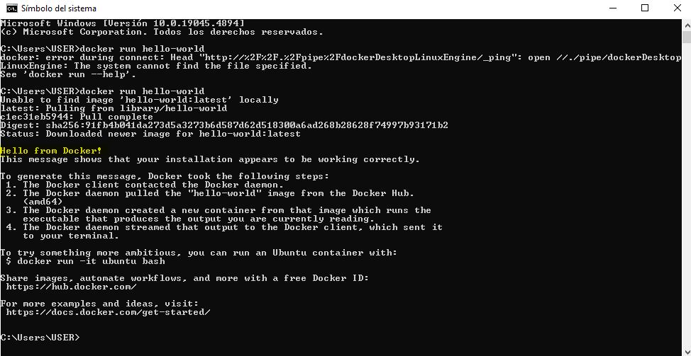
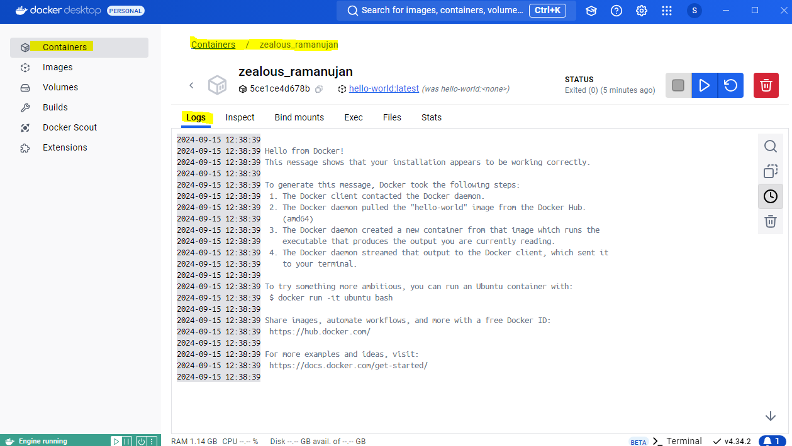
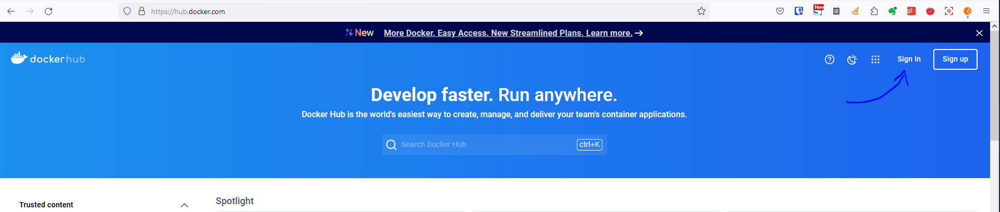
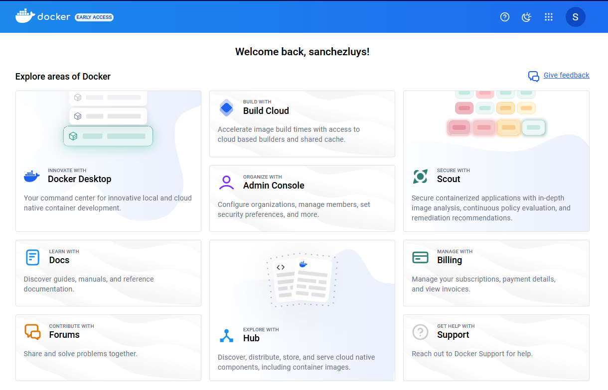
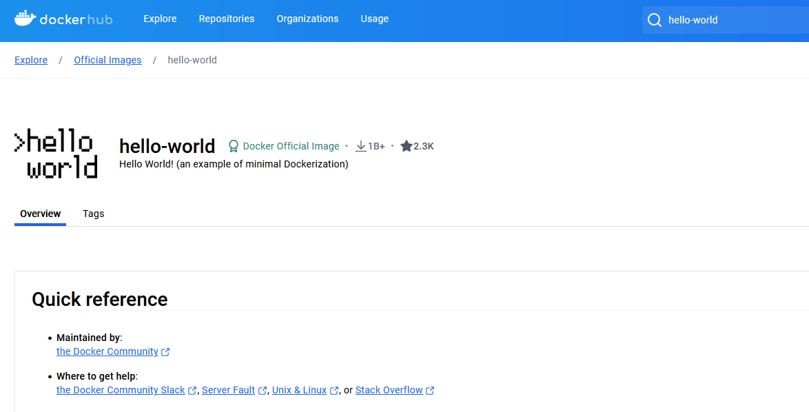
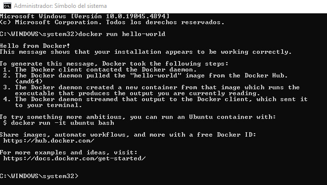
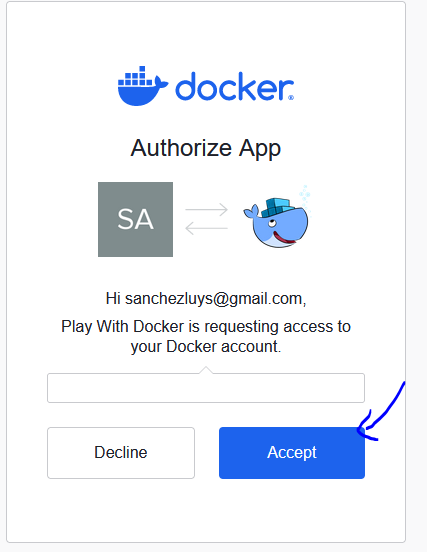
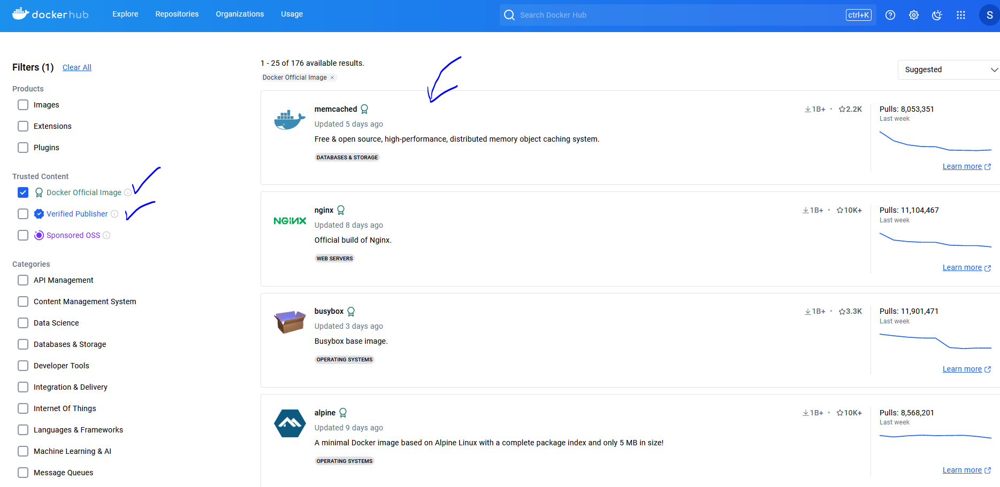
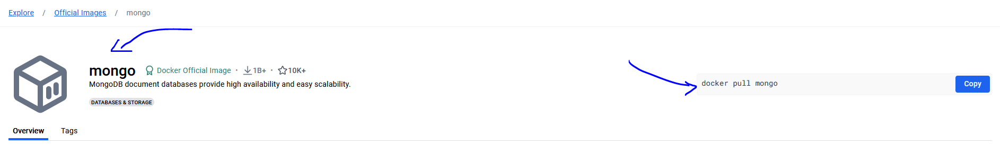

# Aprendiendo-Docker Fundamentos
Guia para el uso de docker

## Docker

- Plataforma de software
- Empaqueta en contenedores
- mayor productividad y facil administracion

## Docker vs maquinas virtuales

- se suelen confundir pero son muy diferentes
- kernel en linux en docker
- antes las empresas usaban las maquinas virtuales
- la maquina virtual tiene mucho peso de almacenamiento
- el objetivo de las maquinas virtuales era que varias maquinas con diferentes sistemas operativos funcionaran en una misma maquina fisica
- la maquina virtual ayuda a aislar el hardware
- en cambio docker permite ejecutar aplicaciones empaquetadas en un entorno aislado
- docker es open source, las aplicaciones se ejecutan indiferentemente del sistema operativo
- un equivalente a docker es podman
- 

## Caracteristicas
- hace que la aplicacion sea totalmente portable
-

## ¿Por que usar docker?

1. Envie mas software, mas rapido
2. Estandarice las operaciones
3. Transfiera de manera sencilla
4. Ahorre dinero

## ¿Cuando usar docker?

1. en microservicios
2. en integracion y entrega continua de despliegues
3. en procesamiento de datos
4. en contenedores como servicio

## Instalacion

- funciona para windows, linux y mac
- para windows:
    - ingresar a https://www.docker.com/
    - descargar el instalador
    - en windows me dio error: 

    

- una vez instalado para verificar que todo esta funcionando desde la terminal ejecutar:

    docker run hello-world

## Registrando en Docker-Hub

- registrarse en este sitio que contiene las imagenes
- 

## Comandos

### docker run hello-world

- si la imagen no esta la trae de internet llamada hello-world, de docker-hub, se trae por defecto la ultima imagen disponible o la mas actual
- se crea un contenedor a partir de esa imagen en nuestro equipo
- tiene un codigo hexadecimal, se pueden usar los 4 primeros digitos de ese codigo
- luego ejecuta el contenedor,
- si se desea volver a ejecutar el contenedor como ya la imagen esta disponible en local no traerá una nueva imagen, ejecuntandose mucho mas rápido.

## Play with docker

- para ejecutar docker en la nube, https://labs.play-with-docker.com/
- es un servicio gratuito
- hoy septiembre 2024 el servicio esta disponible y deja la instancia por 4 horas

## Docker Hub
- muchas imagenes
- de bases de datos
- existen tambien imagenes de empresas

- si por ejemplo quiero usar la imagen de mongodb
- se observa que el comando es: docker pull mongo
- alli aparece el autor de la imagen
- de que se trata la imagen etc
- informacion del como pasar informacion a la imagen
- configuracion de la imagen

11:56

