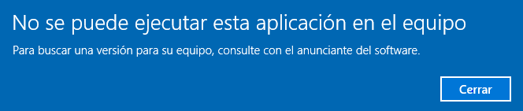
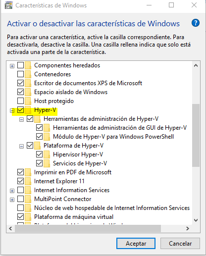
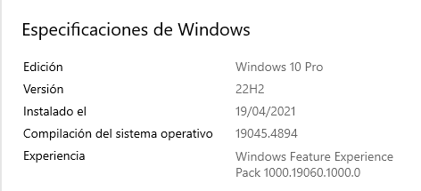
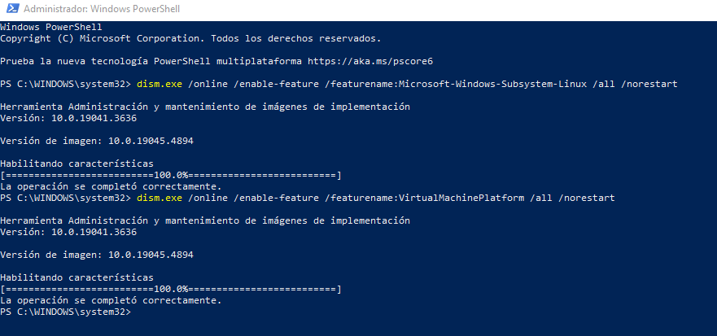

## Para Windows

- windows 10 pro
- 64 bits
- 12 gb de ram

error:

buscado con chat gpt

- Compatibilidad con Hyper-V: Docker Desktop requiere que Hyper-V esté habilitado. Ve a:

    Panel de control > Programas > Activar o desactivar las características de Windows.
    Activa Hyper-V y Plataforma de máquina virtual. Reinicia el equipo si es necesario.

    

- Versión de Docker: Asegúrate de estar descargando la versión correcta de Docker Desktop para tu equipo. Existen versiones para distintas arquitecturas (x86, x64). La versión recomendada para tu equipo sería la de 64 bits (x64).

- Compatibilidad de Windows 10 Pro: Docker Desktop requiere que estés ejecutando una versión de Windows 10 Pro, Education, o Enterprise en la versión 1903 o superior. Verifica tu versión de Windows con el comando winver en el cuadro de búsqueda de Windows.

- Instalación de WSL 2: Docker Desktop para Windows también depende del Subsistema de Windows para Linux (WSL 2). Si aún no lo tienes configurado:

    Abre PowerShell como administrador y ejecuta:

    bash

    dism.exe /online /enable-feature /featurename:Microsoft-Windows-Subsystem-Linux /all /norestart
    dism.exe /online /enable-feature /featurename:VirtualMachinePlatform /all /norestart

    Reinicia el equipo.
    Descarga e instala la actualización del kernel de WSL 2 desde el sitio oficial de Microsoft.

- Actualizar controladores y sistema: Asegúrate de que los controladores de tu sistema estén actualizados, especialmente los relacionados con la virtualización.